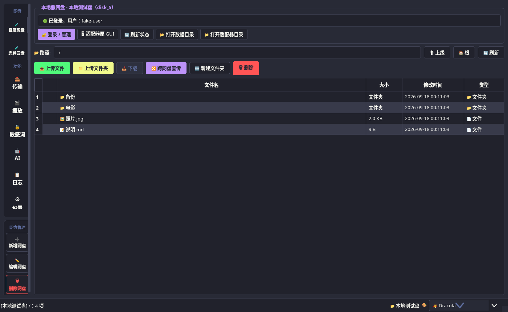
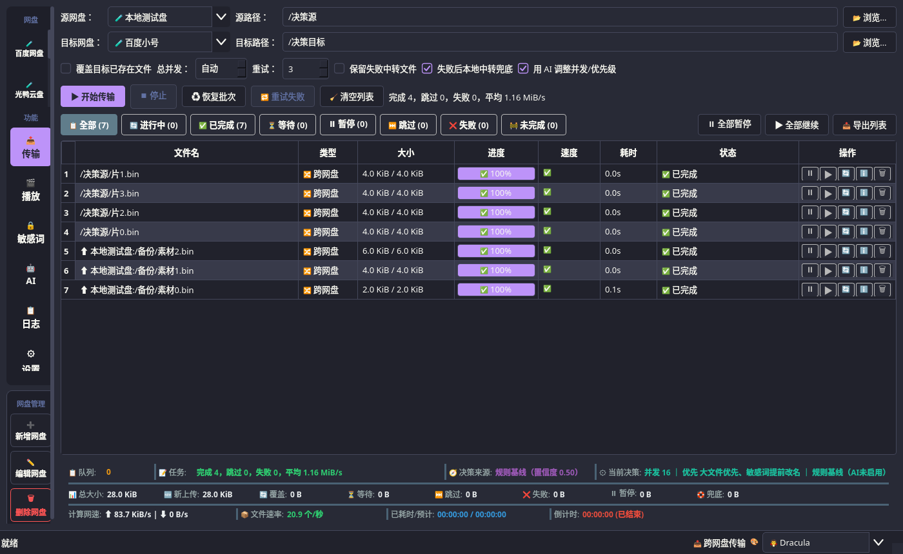
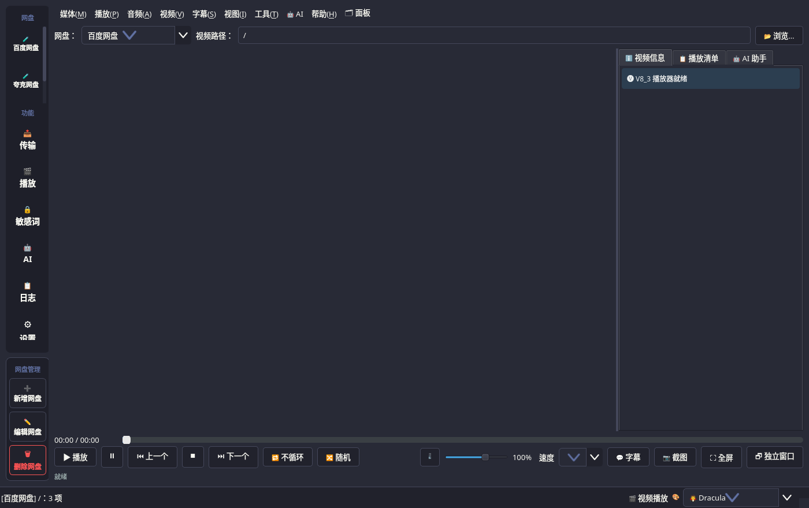
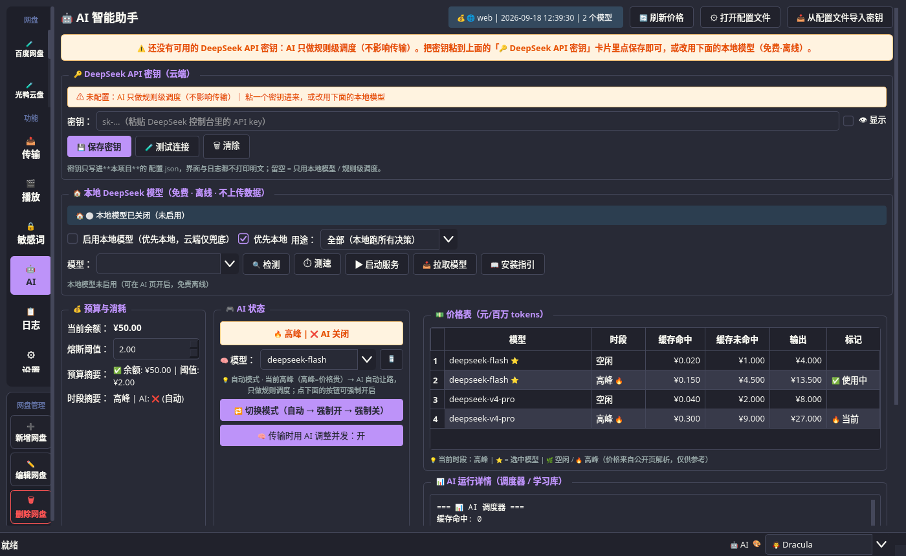
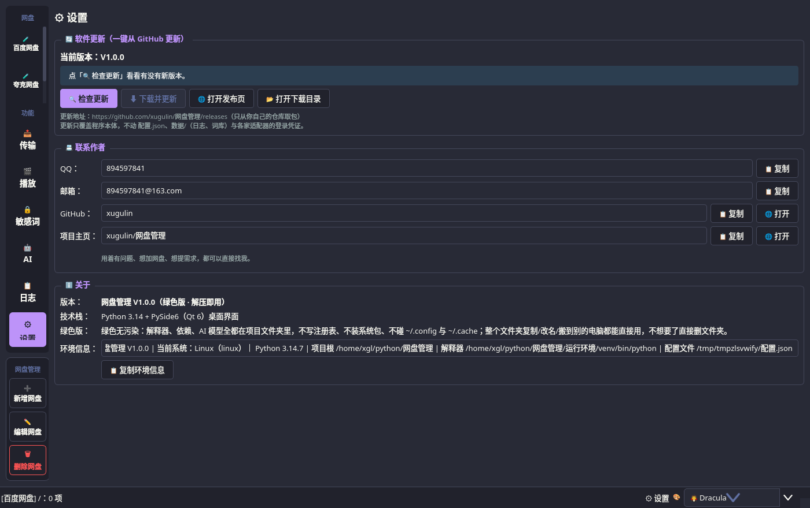

<div align="center">

# 网盘管理 V1.0.9

**一个绿色免安装的网盘管家：百度网盘 · 夸克网盘 · 光鸭云盘，一个界面全搞定**

跨网盘互传 · 直接在线看 4K 视频 · AI 字幕与智能调度 · 解压即用、不装任何东西

[](../../releases)
[](../../releases)
[](https://www.python.org/)
[-41cd52)](https://www.qt.io/)
[](#-绿色无污染)

[下载](#-下载) · [功能](#-功能亮点) · [截图](#-界面截图) · [常见问题](#-常见问题) · [联系作者](#-联系作者)

</div>

---

## 📦 下载

到 [**Releases**](../../releases) 页面下载，**解压就能用**，不需要装 Python、不需要配置环境变量。
每个平台都有两个包，按自己的情况挑一个：

| 系统 | 包 | 大小 | 说明 |
|---|---|---|---|
| **Windows** | `wangpan-manager-V1.0.9-Windows.zip` | 约 466 MB | 解压即用（x64） |
| **Linux** | `wangpan-manager-V1.0.9-Linux.zip` | 约 905 MB | 解压即用（x86_64） |

> 这两个包**都不含 AI 语音模型**（省 400~500 MB）：AI 字幕第一次用的时候会自动联网下模型；
> 不想联网可以自己在 AI 页里装一次，之后离线可用。**本地小模型的 ollama 基座（官方便携版
> 运行时）已经内置**：解压即用，不用自己装 ollama、不需要管理员权限；包里只有基座、
> 没有模型权重 —— 到「AI → 模型商店」一键装模型即可，想升级基座点「⬆️ 更新内置ollama」。
> 基座只带 **CPU / Vulkan** 后端（约 100 MB，CUDA 那两份要 2 GB，会让包顶到 2 GiB 上限）。

**怎么安装（直接整包下载，不用合并分卷）**：

1. 下载对应系统的那个 `.zip`；
2. 解压到**任意文件夹**（路径里最好别有中文以外的怪字符，也别放系统盘根目录）；
3. 进入解压出来的目录，双击 **`启动.exe`**（Windows）或 **`启动.sh`**（Linux）；
5. 想放桌面：Windows 双击 `创建桌面图标.bat`，Linux 执行 `创建桌面图标.sh`；
6. 第一次打开「百度网盘」页 → 点「登录 / 管理」扫码登录，之后就一直记得了。

> 校验用 `SHA256SUMS.txt`（整包 sha256）。从 V1.0.2 起不再分卷 —— 整包直下即可。
>
> 想看到报错信息？Windows 双击 `启动（看报错）.bat`，会在黑窗口里打印日志。

---

## 🆕 V1.0.9 修了什么

**播放时又冒出 "VLC media player" 独立窗口 —— 这次挖到真病根并治本**

前几轮都在治症状（拦掉 `:vout=gl`、起播后巡检再纠正），所以总是复发。这次用真 VLC
把日志一句句读出来（`cvlc -vvv` + Xvfb，2026-09-21）：

- **媒体级的 `:vout=` 根本不生效**：`cvlc ":vout=xcb_x11"` 里 VLC 依旧
  `matching "any"` → 用 `gl`；而 `--vout=xcb_x11`（实例级）才会 `using "xcb_x11"`。
  ⇒ 以前"规则给 4K60 加 `:vout=gl`"、"嵌入时把 `:vout=gl` 剔掉"，改的都是没人看的选项。
- **实例级 `--vout` 会被 `set_xwindow()` 重置**：`--vout=xcb_x11` + `set_xwindow(id)`
  实测仍是 `matching "any"` → `gl`；而嵌入只有 `set_xwindow` 一条路 ⇒ 两者不可兼得。
- **真病根**：给了窗口号之后，VLC 用 `"embed-xid,any"` 找 vout **window** 模块 ——
  优先嵌进我们的窗口，**一旦这次尝试失败就退到 "any"：自己开一个顶层窗口，而且不报错**。
  那个"失败"的现实原因有两个：① 窗口还没真的映射（Qt 说"可见"≠ X 已 map）；
  ② 交出去的是 **Qt 的窗口**（合成器/主题下常是 ARGB、depth 32），visual 不匹配。

**治本做法**：不再把 Qt 的窗口交给 VLC，而是**我们自己用 Xlib 建一个 24 位 TrueColor 的
朴素子窗口**、自己 map 并等到 `IsViewable` 再交出去（`v8_3/播放/嵌入窗口.py`）。
映射与 visual 都由我们保证，VLC 的 embed 尝试就不可能失败 → 那条"自己开窗口"的路走不到。
控件缩放会自动同步，关页时销毁。

真 X11 实测（走应用真实代码路径，连播 3 次 + 一次缩放）：

```
交给 Qt 控件窗口    → matching "embed-xid,any" → 有时落到 "any" → 自开窗口 ✗
交给我们自建的子窗口 → 3/3 全部嵌住，缩放后不游离，收尾无残留 ✓
```

另外三处一并修掉（都是"复发"的帮凶）：

- **任何一次重播都先"停止并等待"**：以前只在窗口号变化时才等，旧 vout 还没释放就起新的
  → 新 vout 会因为 drawable 正忙而自己开窗口。现在 `VLC.播放()` 自己保证先停干净；
  实例级目标（窗口号/输出模块）变了就重建 libvlc 实例。
- **巡检改成整个播放会话都在盯**：连续 60 秒干净就**复位回退阶梯**（以前是会话级只增不减，
  用完两次就再也不救 —— 这正是"同一个毛病反复出现"的直接原因），60 秒内最多救 3 次，
  并且永远不销毁 libvlc 的窗口（那会把 VLC 弄僵、界面跟着卡死）。
- 回退阶梯按**病因**重排：① 关掉 GPU 解码（VAAPI 要用 GL 输出，正是会自己开窗口的那条路）
  ② 换成 `xcb_xv` 输出（另一种能嵌进别人窗口的输出）。

新增回归测试：嵌入宿主单测 3 条 + **真 X11 集成测试**（连播 3 次 + 缩放都不许出现游离窗口；
没有 X11 时自动跳过）。全套 709 条测试在 Xvfb 下全绿；Wine 冒烟确认 Windows 上该模块是
无害空操作（可以自建=false、句柄 0），关窗仍是 0.02 秒。

---

## 🆕 V1.0.8 修了什么

**点右上角的 × 不能立即退出 —— 现在"点了就走"**

- 原因：关窗时要等"在飞的桥调用"落地，预算写的是 **20 秒 + 收尾 6 秒**；
  而 Qt 又是**先跑完 `closeEvent` 才隐藏窗口** —— 只要关窗时有后台线程在跑
  （AI 页预热基座版本、模型市场刷新目录、凭证核对、正在传输……），
  窗口就僵在屏幕上十几二十秒。实测：一个卡住的后台线程 → `close()` 阻塞 **26 秒**。
- 现在：**第一步就隐藏窗口**（点 × 立刻就没），等待预算收到 1 秒 + 0.6 秒，
  还没停的线程从窗口上"摘下来"交给进程退出收掉；`exec()` 返回后再给 1 秒宽限，
  仍在跑的直接结束进程 —— 不会留下"窗口关了但进程还在"。
- 顺带修掉一个更凶的坑：收尾里的 `_活动线程.clear()` 会把**正在运行**的 QThread
  交给垃圾回收，Qt 直接 `Fatal Python error: Aborted`（实测关窗后核心转储）。
- 实测：本地 `close()` **26 秒 → 1.6 秒**；Wine（真 Windows 运行时）复测
  `close秒 1.62、关窗后可见 false`。新增 `tests/test_关窗.py` 四条回归钉住。

**顺手挖出并修掉一个 Qt 层的段错误：连开多个窗口时会崩在"装主题"这一步**

- 本地连跑单测时发现：**三轮回放崩两轮**，faulthandler 现场直指
  `主窗口._应用主题` → `QApplication.setStyleSheet(...)` → `主窗口.__init__`
  （复现脚本来自 `tests/test_退出登录.py` 连续新建主窗口）。
- 原因：每建一个新窗口就把整套 QSS **重装一遍**，而 `setStyleSheet` 会把**所有已存在**
  的控件重新 polish —— 窗口一多，某一轮就崩在样式匹配里（换回调色板档也一样崩，
  说明跟这次的全局层改动无关，是老问题）。
- 现在同一套主题**只装一次**（样式表是应用级的，新建的控件会自动套用；换主题、
  或有人把样式表清掉才会重装）。单测连跑 **4 轮 4/4 全绿**，
  套件耗时 63~70 秒 → **51 秒**（省下的就是每个新窗口白跑的那一遍全树样式匹配）。

---

## 🆕 V1.0.7 修了什么

**Windows 上"界面奇卡无比"的真凶找到了：界面线程在**同步**跑 ollama 子进程**

真机 GitHub Windows runner 分段计时（`工具/界面测速.py`）量到的原始数字：
建主窗口 **54.5 秒**、切到播放页 **36.5 秒**、AI 页 **24.4 秒**、敏感词页 **12.3 秒**。

- 元凶：`已装模型()` 第一件事是 `subprocess.run(["ollama", "list"], timeout=30)`，
  而 AI 页构建时这条路径被走了 **3 次**；`内置运行时说明()` 又同步跑了一次
  `ollama --version`。Windows 上**第一次**拉起一个没有签名的 `ollama.exe`，
  Defender 会先把它整个扫一遍（20 秒起步）——界面就这么被顶住了。
- 修法（原则：**界面线程只读缓存/读磁盘，绝不碰子进程与网络**）：
  * 直接读 ollama 模型仓库的 `manifests/` 清单列已装模型（毫秒级；层没下全的不算"已装"）；
  * 内置基座版本号改成内存 + 磁盘缓存（按 exe 的大小/修改时间做键，换过基座自动失效），
    界面只读缓存，后台线程负责"预热"一次；
  * 只有后台线程才允许真的跑 `ollama list`。
- 结果（同一台真机）：建主窗口 **54.5 s → 6.8~8.5 s**、切到播放页 **36.5 s → 40 ms**、
  AI 页 **24.4 s → 147 ms**、敏感词页 **12.3 s → 40 ms**；
  Windows 上跑整套单测 **500 s → 69 s**。

**主题样式表：把"全局那一层"从 QSS 换成 QPalette（再快 1.6~3 倍）**

- 先量出来：把整套 QSS 清掉后再切同样几页，12.3 秒 → **40 毫秒** ——
  贵的不是控件、不是布局，是样式匹配。其中 `QWidget { background-color; color;
  font-size }` 这条规则**每个控件**都要沾一次，字号变化还会连锁触发整棵树重算尺寸。
- 现在背景/文字/选中色走 `QPalette`、字号走应用字体，QSS 里删掉那条全局规则。
  真机实测：建主窗口 **11.2 s → 6.8 s**、切到播放页 **107 ms → 40 ms**。
- 视觉回归：8 个页面 × 1440×900 两档各渲染一遍做像素比对，差异只有
  **0.16%~0.41%**（抗锯齿级别），Dracula 与 GitHub Light 两套主题肉眼都一致。
  万一遇到"某处颜色不对"：设环境变量 `V8_3_主题全局层=样式表` 重启即可退回老写法。

**小分辨率屏幕的动态适配（这次是真的会重排了）**

- **AI 状态页**：窗口不够宽时，四张卡片从"三列并排"自动改成"上下堆叠"——
  以前 1024×600 上右边的价格表会被窗口边缘直接裁掉，用户既看不见也滚不到；
  阈值按控件自己的 `sizeHint` 算，Windows 字体更宽时阈值自动抬高，不写死像素。
- **窗口尺寸再夹一次**：高 DPI 缩放下逻辑分辨率会变小（1366×768 @150% → 911×512），
  现在窗口的初始尺寸与最小尺寸都不会超出屏幕可用区。
- 窗口宽度变化会通知各页面重排；页面自己判断"要不要动"，所以拖动窗口不会反复重建布局。
- 1366×768 这类常见笔记本分辨率上仍是原来的三列布局（实测无裁切），
  只有真的放不下才堆叠。

**「创建桌面图标」在真 Windows 上其实只做出了一个坏兜底 —— 现在是真的 .lnk 了**

- 真机 windows-latest 日志把失败点钉到了唯一一步：`WScript.Shell` 的
  `lnk.TargetPath = <含中文的路径>` 抛 `5 Invalid procedure call or argument`，
  而 `Save` 仍然"成功" → 留下一个**没有目标**的空壳 .lnk（双击没反应）；
  旧版于是退到"把启动器复制到桌面"的兜底 —— 可那个启动器是靠**自己所在目录**找项目的，
  复制到桌面只会弹"找不到解释器"，等于给了用户一个坏图标。
- 根因：那条路内部按**系统 ANSI 代码页**处理路径，英文版 Windows（CP1252）上中文被折成
  `?`；中文 Windows / Wine 上碰巧能过 —— 所以本地怎么测都测不出来，只能靠真机 CI。
- 现在：用 `Shell.Application` 的 `ShellLinkObject`（Shell32 原生 Unicode 接口）写中文
  目标，**建完还把目标读回来核对**（只判断"文件存在"会把空壳 .lnk 当成功）；真建不出来
  再降级到 PowerShell + `IShellLinkW`（内联 C#，不装任何东西），最后才是桌面 .vbs 启动器。
- 真机验收（工作流「测试 创建桌面图标」）：桌面生成 `网盘管理.lnk`，用 `IShellLinkW`
  读回的目标就是包里 `启动.exe` 的完整中文路径。

**其他**：AI 页顶部那个 `builtin | 内置兜底 | 3 个模型` 小徽标已删除（上一版资源是更早
构建的，所以还能看到）；播放时多出游离 VLC 窗口 / 关窗卡死的问题也已修掉。

---

## 🆕 V1.0.6 修了什么

**「创建桌面图标」乱码 / 创建失败 —— 用 Wine 实测定位到真原因**

- **cmd 的 `if exist "中文名"` 匹配不上中文文件名**：cmd 是按**控制台代码页**把 .bat
  当字节解析的，中文字面量必然失配（Wine 实测：文件就在旁边也报找不到）；项目路径本身
  常是中文（如 `D:\网络软件\网盘管理`），连 `%HERE%` 展开都带中文。**这就是失败的根因。**
- **PowerShell 在部分系统上不可用/被策略禁用**，所以不能只靠它建快捷方式。
- 新的做法：**`创建桌面图标.vbs`**（Windows 自带 cscript，中文用 `ChrW()` 拼、文件用
  UTF-16LE 保存，完全不碰编码问题）+ 纯 ASCII 的 .bat 转发器（用**通配符**找文件，
  绕开字节比较）。cscript 万一也不行，会把启动器直接复制到桌面兜底。
- 顺带修：包里新增纯 ASCII 的 **`启动.bat`**（双击即用），并同时探测
  `运行环境\venv\Scripts` 与 `运行环境\python` 两处解释器。

**实测（Wine + 真实 Windows 包）**

```
在 F:\tmp\win105\中文 目录 测试（中文+空格路径）运行 创建桌面图标.bat：
  [OK] desktop shortcut created: C:\users\xgl\Desktop\网盘管理.lnk
  target: ...\中文 目录 测试\启动.exe
桌面生成：网盘管理.lnk（中文名正确）
```

**界面卡顿：诊断工具实测可用**

- `启动.py --性能诊断`（或 `V8_3_卡顿诊断=1`）会把"卡住时主线程在哪一行"写进
  `数据/卡顿诊断.log`（含系统/Python/平台插件/屏幕缩放倍数）——
  已在 Wine 的 win32 环境实测跑通。真机复现卡顿后把该文件发出来即可定位。

> 三家网盘功能与 V1.0.5 一致；播放相关修复见 V1.0.4。


**Windows 实机反馈的两件事**

1. **「创建桌面图标.bat」终端乱码且创建失败** —— 两个原因都修了：
   * cmd 按**控制台代码页**解析 .bat 的字节，文件里的中文（含 `%HERE%` 这种中文路径）
     被解成乱码、命令行被拆坏 → 现在这个 .bat **只用 ASCII**，
     中文快捷方式名由 PowerShell 用码点拼出来，彻底不依赖编码；
   * 包里**没有 `启动.exe`**（构建机没编出来时就不会有），而旧脚本写死了指向它 →
     现在新增 **`启动.bat`**（纯 ASCII，双击即用，找不到 exe 也能启动），
     并且创建快捷方式时按 `启动.exe → 启动.bat → 启动.py` 挑真实存在的那个。
2. **界面卡顿** —— 不再靠猜：新增 **`启动.py --性能诊断`**，
   卡顿时会用 `sys._current_frames()` 抓**主线程当前在哪一行**，写进
   `数据/卡顿诊断.log`（同时记录系统/Python/平台插件/**屏幕分辨率与缩放倍数**）。
   另外启动时显式打开高 DPI 像素图、关掉 Windows 原生菜单栏（主题样式在原生菜单栏上
   既不生效又触发额外重绘）。

> 三家网盘功能与 V1.0.4 一致（百度支持扫码 / 短信（内置浏览器跳转）/ Cookie）。
> 播放时的「多出 VLC 窗口」问题已在 V1.0.4 修复。


**修「播放时多出一个 VLC media player 窗口」**（这次挖到根上了）

- 现象：程序里在放视频，屏幕上**又多一个 `VLC media player` 窗口**也在放同一个视频；
- 根因有两层：
  1. **libvlc 拿到"还没映射到屏幕"的窗口号时会自己开顶层窗口**。而 Qt 的
     `isVisible()/isExposed()` 说"可见"**并不代表 X 服务器已经映射好窗口** ——
     实测：没 show 的窗口 X 里 `map_state=0`，show 之后才是 `2`；
  2. 程序里**两个**播放窗口（播放页 / 独立窗口）各写了一套"就绪判断"，
     修好一个、另一个还在漏 —— 这就是"修了还有"的原因。
- 修法：
  * 判断**收敛成唯一入口**（`v8_3/界面/窗口就绪.py`）：以 **X 的 `map_state`** 为准，
    Qt 状态只作兜底；两个播放窗口都改用它；
  * 起播前**轮询等窗口真的上屏**（最多约 2.5 秒），等不到就明确提示
    "窗口迟迟没上屏，先不起播（避免多出 VLC 窗口）"，**不再硬播**；
  * 真的冒出游离窗口时：先"停止→重绑→重播"收回（换绑前必须停住，否则会**多开一个**），
    自愈最多 2 次，之后只清窗口并提示手动恢复；清理时**连子窗口一起销毁**；
  * 关闭播放时再兜一层：扫一遍清掉残留的游离窗口。

**修「一键启动点了没反应」**（V1.0.3 的延续）

- 启动脚本现在放在**项目里**或**项目外面**都能找到项目（以前只扫子目录）；
- **过期/串号的 PID 文件不再锁死启动**（会核对进程命令行是不是本项目的 `启动.py`）；
- 新增 `数据/一键启动.log`（每次启动记一行：时间/解释器/退出码/是否已在运行）、
  `一键启动（看报错）.desktop`、`使用说明.txt`；包内 `启动.sh` 同样能力。

> 三家网盘功能与 V1.0.3 一致（百度支持扫码 / 短信（内置浏览器跳转）/ Cookie）。


**修「一键启动点了没反应」**

- 一键启动脚本原来只会**扫自己的子目录**找项目，脚本放在**项目根里**时就报
  `project not found`（现在先认自己所在的目录，再扫子目录）；
- **过期/串号的 PID 文件会锁死启动**：以前只要"这个进程号还活着"就认为程序在运行，
  但进程号会被系统回收给别人 → 永远报"已经在运行"、窗口不出现。
  现在会核对它的命令行是不是本项目的 `启动.py`；
- 新增 **`数据/一键启动.log`**：每次启动都记一行（时间 / 解释器 / 退出码 / 是否已在运行），
  双击启动看不到终端时，至少有个文件能查；
- 新增 **`一键启动（看报错）.desktop`**：带终端启动，报错直接打在屏幕上；
- 附带 **`使用说明.txt`**：启动方式 + 起不来怎么排查。

**删掉了「预热登录页」（它是上一版引入的坑）**

- 上一版为了提速，在后台用隐藏控件先加载登录页、点登录时接管那个页面。
  实测**两次都出现窗口一片空白**：QtWebEngine 在"隐藏视图里加载 + 视图换父"这两件事上
  都不可靠；
- 而且那个"提速"是量错的：我用 `loadFinished` 当计时终点，而百度首页是 SPA、
  **`loadFinished` 经常压根不触发**。真显示下重量：窗口自己加载，首次约 3 秒、
  之后（缓存热了）**0.2 秒以内** —— 预热没有可量化收益，已整个删除；
- 保留两条**防白板兜底**：页面还在加载/DOM 过短时就自动重载一次（打开后 4 秒自查 + 加载完再查）。

> 三家网盘功能与 V1.0.2 一致（百度支持扫码 / 短信（内置浏览器跳转）/ Cookie）。


**百度网盘登录变好用了（这一版的重点）**

- **百度支持「短信登录」**：点「登录 / 管理 → 短信登录」里的
  「📱 短信登录（内置浏览器跳转，推荐）」，会直接打开内置浏览器并**跳到短信登录页**，
  填手机号 → 收验证码 → 登录 就行；
  - 为什么走内置浏览器：百度的短信验证码带**风险验证**（要走登录框里的风控组件），
    在程序里直接调接口会被拒 —— 这是实测结论，不是偷懒；
- **登录成功后自动收工**：窗口会**自动取走完整会话并自动关闭**，
  不用你再手动关窗、也不用点"我已登录完成"；
- 修掉一个会让你白登一次的坑：登录成功立刻关窗时，可能报
  "已捕获 0 条 cookie"（其实是**取早了** —— 浏览器还在把 cookie 落盘）。
  现在取 cookie 带重试 + 网络层信号触发，并且**取不到就如实说明、不再误报"没登录成功"**；
- 百度「短信登录」页去掉了用不了的发码输入框，只留一个能用的按钮。

**体积更小、更干净**

- 运行环境进一步精简（Linux 包 998 MB → **861 MB**，Windows 包 442 MB → **429 MB**）；
- 打包时会抹掉构建机的私有路径，别人解压后不会看到作者的家目录；
- 新增 `工具/清登录数据.py`：换账号/送人前一条命令清掉所有登录数据。

> 三家网盘（百度 / 夸克 / 光鸭）功能与 V1.0.1 一致；这一版主要是登录体验与体积。

## ✨ 功能亮点

### 🟢 绿色无污染
- **解压即用**：Python 解释器、Qt 界面库、AI 模型全都在文件夹里，双击就跑；
- **不装任何东西**：不写注册表、不装系统包、不动 `~/.config`、`~/.cache`、`~/.local`；
- **整个文件夹就是一个软件**：复制到 U 盘、改名、搬到别的电脑都能直接用；不想要了**直接删文件夹**，不留残留；
- 运行时的缓存、日志、登录凭证全部落在**自己的文件夹**里。

### ☁️ 一个界面管理国内主流网盘

| 网盘 | 状态 | 登录方式 |
|---|---|---|
| 🅱 **百度网盘** | ✅ | 扫码 / **短信**（内置浏览器）/ Cookie |
| 🅠 **夸克网盘** | ✅ | 扫码 / Cookie |
| 🦆 **光鸭云盘** | ✅ | 扫码 / 短信 / 令牌 |

- **同一家网盘可以挂多个账号**（大号/小号分开展示，各自独立登录）；
- 每个网盘一个页签：浏览目录、上传（文件/文件夹）、下载、新建文件夹、删除、右键菜单；
- 文件列表分页加载，几万个文件也不卡。

### 🔁 跨网盘互传（本项目的看家本领）
- **百度 ↔ 夸克 ↔ 光鸭** 任意方向互传，不用先下载到本地再上传；
- 走**直链 + 多线程 + 分片**，支持**断点续传**：网断了、程序关了，重新打开还能接着传；
- **同名语义**分得清：同名同大小跳过、同名不同大小给出提示、需要覆盖才覆盖；
- 批量小文件有专门的并发策略；任务表实时显示速度、进度、剩余时间；
- **未完成的批次可以暂停 / 恢复**，传输记录与统计都留档。

### 🎬 直接看网盘里的 4K 视频
- 内置 **libvlc** 内核，网盘里的视频**不用下载**就能播，**4K / 高码率**也能流畅拖动进度条；
- 播放列表、倍速、字幕轨切换、音轨切换、记忆播放位置；
- 支持**边下边播**与**本地缓存**，看第二遍直接命中缓存；
- 独立播放窗口，可以一边看一边刷文件列表。

### 🤖 两种 AI 都能用（本地 + 云端 API）
- **本地 AI**：接 Ollama / 任何 OpenAI 兼容端点（llama.cpp、LM Studio、vLLM…），**免费、离线、数据不出本机**；一键检测 / 测速 / 拉取模型；
- **云端 AI**：填一个 DeepSeek API Key 即可（**设置页里直接填，不用改配置文件**），带**余额查询、价格表、时段策略**（高峰自动让路、空闲时段才调）与预算熔断，**不会悄悄烧钱**；
- AI 用来做什么：传输并发与优先级的智能调度、失败诊断、**视频自动生成中文字幕**（faster-whisper，纯 CPU 就能跑，不上传任何音视频）。

### 🔒 其他实用功能
- **敏感词库 + 上传前自动改名**：上传前预检、命中就替换成安全词，并记录改名历史；
- **一键更新**：设置页里点一下就从 GitHub 拉最新版（自动认 Windows / Linux），**只覆盖程序本体，不动你的配置、日志与登录凭证**；
- 10 套主题（Dracula / Nord / Tokyo Night / Catppuccin…），深浅色都有。

---

## 🖼 界面截图

<div align="center">

**网盘页 · 浏览与传输**



**跨网盘传输 · 多任务并发与实时进度**



**视频播放 · 网盘 4K 直接看**



**AI 助手 · 密钥 / 余额 / 价格 / 调度一屏掌握**



**设置页 · 一键更新与联系方式**



**新增网盘 · 只填类型和名字，其余自动配好**


</div>

---

## 🚀 为什么不用官方客户端 / 别的工具？

- 官方客户端只能管**自己家**的网盘，想互传就得先下载再上传，还要开着电脑慢慢等；
- 网页版不能直接播 4K、不能断点续传、更不能跨盘搬家；
- 市面上的聚合工具大多要装 Docker、要跑 Alist、要自己配一堆参数。

**这个项目把这些都省了**：一个文件夹，双击启动，三个网盘一起管，跨盘互传 + 4K 播放 + AI 字幕。

---

## ❓ 常见问题

<details>
<summary><b>会不会偷偷上传我的文件 / 会不会泄露账号？</b></summary>

不会。传输是**本机直接跟网盘服务器**通信（走各网盘自己的官方接口），没有中间服务器；
登录凭证只存在你自己的文件夹（`适配器/<网盘>/数据/`）里；本地 AI 模式**一个字节都不出本机**。
</details>

<details>
<summary><b>需要先装 Python 或 Qt 吗？</b></summary>

不需要。解释器和依赖库都打包在压缩包里了，这就是"绿色版"的意思。
</details>

<details>
<summary><b>为什么压缩包这么大？</b></summary>

里面有一整套 Python 3.14 + Qt6 界面库（约 700 MB）+ 语音识别模型（460 MB）。
精简版去掉了模型，小 460 MB。
</details>

<details>
<summary><b>能放在 U 盘 / 移动硬盘里用吗？</b></summary>

可以。整个文件夹是自包含的，插到别的电脑上照样双击启动
（Windows 版在 Windows 上用，Linux 版在 Linux 上用）。
</details>

<details>
<summary><b>怎么升级到新版本？</b></summary>

打开「⚙ 设置 → 🔄 软件更新 → 检查更新」，一键更新并自动重启。
也可以直接下载新包解压覆盖（**你的配置和登录状态不会丢**）。
</details>

<details>
<summary><b>发现 bug / 想要新功能？</b></summary>

直接找我（见下方联系方式），或者到 Issues 提。
提问题时可以在「设置 → 关于」里点「复制环境信息」，把那段贴给我，能省很多来回。
</details>

---

## 📇 联系作者

| 方式 | 联系方式 |
|---|---|
| **QQ** | **894597841**（首选，加好友请说明来意） |
| **邮箱** | **894597841@163.com** |
| **GitHub** | [@xugulin](https://github.com/xugulin) |
| **项目地址** | https://github.com/xugulin/wangpan-manager |

> 仓库名用英文 `wangpan-manager`：GitHub 不接受中文仓库名（会被清洗成 `-`），
> 中文名「网盘管理」保留在仓库简介、本标题与软件界面里。

用着有问题、想加新的网盘、想提需求，都可以直接找我。

---

## 🧩 技术栈

- **Python 3.14** + **PySide6（Qt 6）** 桌面界面，10 套主题；
- 每个网盘跑在**独立子进程**里（行式 JSON 协议），一个网盘崩了不影响其他；
- 播放内核 **libvlc**；语音识别 **faster-whisper / CTranslate2**（纯 CPU int8）；
- 传输引擎自带并发调度、分片、断点续传、缓存与统计。

想了解实现细节与开发过程，看 [`docs/DEVELOPMENT.md`](docs/DEVELOPMENT.md)。

---

## ⚠️ 免责声明

- 本项目**仅供个人学习与技术交流**，请勿用于商业用途或任何违法用途；
- 请遵守各网盘服务商的用户协议，因使用本软件产生的一切后果由使用者自行承担；
- 项目不收集、不上传任何用户数据；账号凭证只保存在本地。

如果这个项目帮到了你，欢迎点个 ⭐ **Star** 支持一下，也欢迎分享给同样被网盘折磨的朋友。

<div align="center">

**关键词**：网盘管理 · 百度网盘客户端 · 夸克网盘 · 光鸭云盘 · 跨网盘传输 · 网盘互传 · 网盘播放器 · 4K 视频播放 · 在线看网盘视频 · AI 字幕 · 语音转字幕 · 本地 AI · DeepSeek · 绿色软件 · 免安装 · 解压即用 · Python · PySide6 · Qt6 · Windows · Linux

</div>
